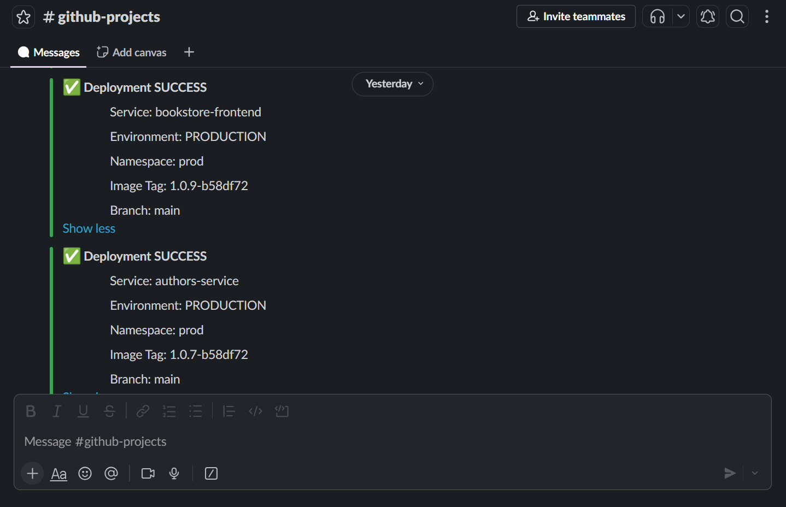
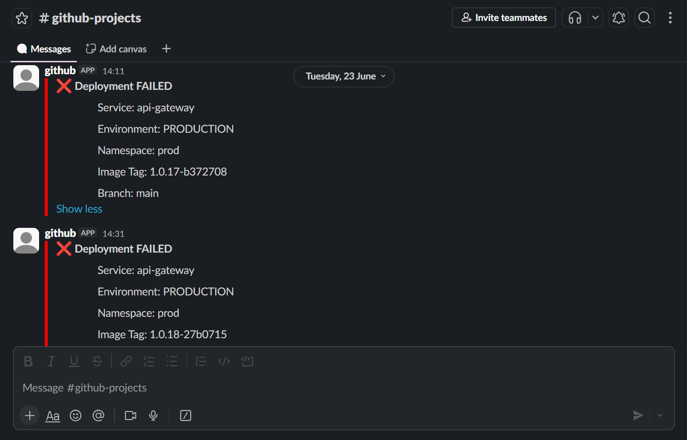

# github-shared-workflow

Reusable GitHub Actions workflow that standardizes CI/CD across repositories, including build, test, Docker image creation, Kubernetes deployment, and Slack notifications.

---

## Repository Structure

```
github-shared-workflow/
└── .github/
    └── workflows/
        └── ci-cd-pipeline.yml    # The reusable workflow
```

---

## Usage

### Backend Service

```yaml
name: CI CD Pipeline Api Gateway

on:
  push:
    branches: [main, dev]
    paths:
      - 'services/api-gateway/**'

jobs:
  pipeline:
    uses: username/github-shared-workflow/.github/workflows/ci-cd-pipeline.yml@main
    with:
      service-name: api-gateway
      docker-image: username/ci-cd-gateway
      service-dir:  services/api-gateway
    secrets:
      DOCKER_USERNAME: ${{ secrets.DOCKER_USERNAME }}
      DOCKER_PASSWORD: ${{ secrets.DOCKER_PASSWORD }}
      KUBECONFIG_DEV:  ${{ secrets.KUBECONFIG_DEV }}
      KUBECONFIG_PROD: ${{ secrets.KUBECONFIG_PROD }}
      SLACK_BOT_TOKEN: ${{ secrets.SLACK_BOT_TOKEN }}
      SLACK_CHANNEL_ID: ${{ secrets.SLACK_CHANNEL_ID }}
````

### Frontend Service

```yaml
jobs:
  pipeline:
    uses: username/github-shared-workflow/.github/workflows/ci-cd-pipeline.yml@main
    with:
      service-name: bookstore-frontend
      docker-image: username/ci-cd-frontend
      service-dir:  services/bookstore-frontend
      service-type: frontend
    secrets:
      DOCKER_USERNAME: ${{ secrets.DOCKER_USERNAME }}
      DOCKER_PASSWORD: ${{ secrets.DOCKER_PASSWORD }}
      KUBECONFIG_DEV:  ${{ secrets.KUBECONFIG_DEV }}
      KUBECONFIG_PROD: ${{ secrets.KUBECONFIG_PROD }}
      SLACK_BOT_TOKEN: ${{ secrets.SLACK_BOT_TOKEN }}
      SLACK_CHANNEL_ID: ${{ secrets.SLACK_CHANNEL_ID }}
```

Use `paths:` to scope each caller workflow to its own service directory. A push that only touches `services/books-service/` will not trigger any other service's pipeline.

---

## Inputs

| Input          | Required | Default | Description                              |
| -------------- | -------- | ------- | ---------------------------------------- |
| `service-name` | ✅        | —       | Service identifier used for Helm release |
| `docker-image` | ✅        | —       | Docker image name                        |
| `service-dir`  | ✅        | —       | Path to service in repository            |
| `service-type` | ❌        | backend | backend (Maven) or frontend (Node.js)    |
| `java-version` | ❌        | 17      | JDK version for backend builds           |

---

## Required Secrets

| Secret             | Description                        |
| ------------------ | ---------------------------------- |
| `DOCKER_USERNAME`  | Docker Hub username                |
| `DOCKER_PASSWORD`  | Docker Hub token/password          |
| `KUBECONFIG_DEV`   | Kubernetes dev cluster kubeconfig  |
| `KUBECONFIG_PROD`  | Kubernetes prod cluster kubeconfig |
| `SLACK_BOT_TOKEN`  | Slack bot token for notifications  |
| `SLACK_CHANNEL_ID` | Slack channel ID for alerts        |

---

## Slack Integration

The reusable workflow sends a Slack notification after every deployment using the Slack Web API (`chat.postMessage`). Notifications are sent regardless of whether the deployment succeeds or fails and include:

* Deployment status (Success/Failed)
* Service name
* Environment
* Kubernetes namespace
* Docker image tag
* Branch

### Required Secrets

| Secret             | Description                                   |
| ------------------ | --------------------------------------------- |
| `SLACK_BOT_TOKEN`  | Slack Bot User OAuth Token (`xoxb-...`)       |
| `SLACK_CHANNEL_ID` | Slack channel ID where notifications are sent |

### Successful Deployment Slack Message


### Failed Deployment Slack Message


---

## Pipeline Stages

1. Build
2. Test
3. Docker Build & Push
4. Deploy (Helm)
5. Slack Notification

---

## Build Stage

* Backend: `mvn clean package`
* Frontend: `npm ci && npm run build`
* Produces versioned Docker image tag
* Tags `latest` on `main` branch

---

## Test Stage

* Backend: `mvn test`
* Frontend: `npm ci && npm run test`
* Fails pipeline if tests fail

---

## Deploy Stage

* Deploys using Helm
* Dev branch → `dev` namespace
* Main branch → `prod` namespace
* Uses image tag from build job output
* Production deployments require GitHub Environment approval

---

## Slack Notifications

Slack notification is sent after pipeline execution.

### Behavior

* Runs regardless of success/failure
* Uses Slack Web API (`chat.postMessage`)
* Color-coded status messages:

  * Green → success
  * Red → failure

### Payload includes:

* Service name
* Branch
* Status
* Image tag
* Pipeline result context

### Required Secrets

* `SLACK_BOT_TOKEN`
* `SLACK_CHANNEL_ID`

---

## Pipeline Flow

```
Build
  ↓
Test
  ↓
Docker Build & Push
  ↓
Deploy (Helm)
  ↓
Manual Approval (prod)
  ↓
Slack Notification
```

---

## Output Passing Between Jobs

The build job exposes the image tag:

```yaml
outputs:
  image-tag: ${{ steps.version.outputs.tag }}
```

Deploy consumes it:

```yaml
--set global.imageTag=${{ needs.build.outputs.image-tag }}
```

---

## Related Repositories

* [https://github.com/rouisskhawla/reliable-ci-cd-pipeline](https://github.com/rouisskhawla/reliable-ci-cd-pipeline)
* [https://github.com/rouisskhawla/jenkins-shared-library](https://github.com/rouisskhawla/jenkins-shared-library)
* [https://github.com/rouisskhawla/gitlab-shared-template](https://github.com/rouisskhawla/gitlab-shared-template)
